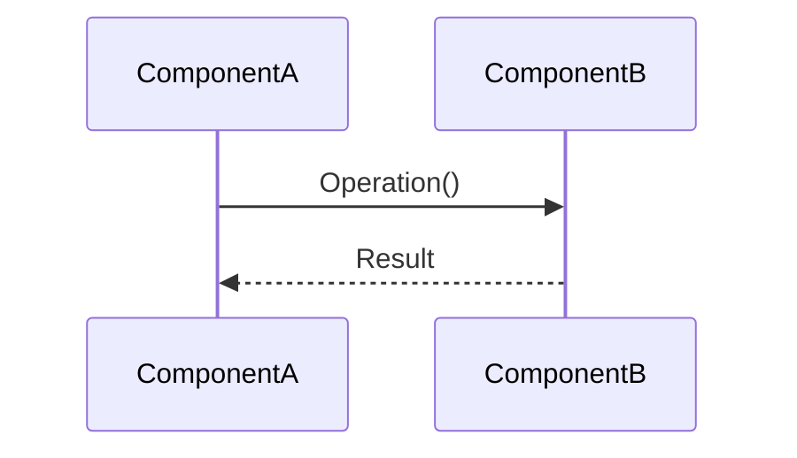

# Spec: {Title}

<!--
File name: .specs/Spec-{ID}-{kebab-case-slug}.md
  - Jira ID present:       Spec-SORT-42.md
  - GitHub issue present:  Spec-238-codex-agent-adapter.md
  - Neither present:       Spec-agent-max-turns-passthrough-leak.md
Keep the title under ~60 characters. Title in H1 matches the filename slug
in human-readable form.
-->

**Created at:** {ISO timestamp} \
**Issue ID:** {#NNN or SORT-NNN or N/A} \
**Feature:** {One-sentence summary of the feature or change.}

---

## 1. Business Goal & Value

<!--
Concise summary of WHAT we are solving and WHY. Map to the architecture doc's
problem statement (Section 1) or a specific GitHub issue. State the user-facing
or system-facing impact of NOT solving this.

Keep to 2-4 paragraphs. End with the Spec Compliance Check table.
-->

### Spec Compliance Check

| Principle                    | Aligned | Notes                                |
|------------------------------|---------|--------------------------------------|
| Architecture doc conformance | _/_ | Section reference(s) checked             |
| ADR compatibility            | _/_ | Which ADRs checked and outcome           |
| Milestone sequencing         | _/_ | Prerequisite milestones and their status |
| Single-binary constraint     | _/_ | Dependencies added (if any)              |
| Adapter boundary             | _/_ | Core vs adapter scope classification     |

---

## 2. System Diagram (Mermaid)

<!--
Create a Mermaid sequence or component diagram showing the data flow through
the system's layers. Use this layer order as the axis:

  Tracker Adapter -> Orchestrator -> Workspace Manager -> Agent Adapter -> Observability

Include only components the feature touches. Label messages with the domain
operation name (e.g., "FetchIssuesByStates()", "Dispatch()"), not
implementation details.
-->



---

## 3. Technical Architecture

<!--
The core design section. Fill only the subsections relevant to this feature.
Delete unused subsections rather than leaving them empty.
-->

### Go Interfaces

<!--
Method signatures and contracts for new or modified interfaces. Include
doc comments describing the contract (preconditions, postconditions, error
semantics). Do NOT write method bodies.
-->

### Struct Definitions

<!--
Field layouts for domain entities, config types, and internal state.
Include field types and doc comments explaining non-obvious fields.
-->

### SQLite Schema

<!--
Table definitions (CREATE TABLE), migrations, index definitions, and
query patterns (as commented SQL). Use WAL mode assumptions. Single-writer
only. Use modernc.org/sqlite (pure Go, no CGo).

Delete this subsection if the feature does not touch persistence.
-->

### State Machine Transitions

<!--
Which orchestration states are affected and how. Reference the state
machine in architecture Section 7. Use a transition table or Mermaid
stateDiagram.

Delete this subsection if the feature does not affect state transitions.
-->

### Error Categories

<!--
Normalized error types following the architecture doc's error taxonomy.
Define the Kind, whether it is retryable, and the user-facing message
pattern.
-->

### Adapter Boundaries

<!--
What lives in core (internal/orchestrator, internal/domain, internal/workspace)
vs. what lives in adapter packages (internal/tracker/*, internal/agent/*).
Explicit boundary definition prevents coupling violations.

Delete this subsection if the feature is entirely within one layer.
-->

---

## 4. Implementation Steps

<!--
Ordered steps sized for single agent sessions. Each step MUST have a
Verify condition that an implementer can execute to confirm the step
is complete. Steps should follow the dependency order:
Domain -> Config -> Persistence -> Adapters -> Workspace -> Orchestrator -> CLI

Example step format:

1. **Define the FooBar interface**
   - File: `internal/domain/foobar.go`
   - Add FooBar interface with methods X, Y, Z per Section N.N
   - **Verify:** `go build ./internal/domain/...` compiles

2. **Implement SQLite migration for foo_table**
   - File: `internal/persistence/migrations/NNNN_create_foo.go`
   - CREATE TABLE with columns per Section N.N
   - **Verify:** `make test` passes; table exists after migration
-->

---

## 5. Risk Assessment

| Risk                        | Severity | Mitigation                                   |
|-----------------------------|----------|----------------------------------------------|
| _e.g., workspace path escape_ | Critical | _Path containment check per Section 9.6_    |

<!--
Identify risks with severity (Critical / High / Medium / Low) and concrete
mitigation strategies. Security boundaries (workspace path containment,
key sanitization, cwd validation) are always relevant when the feature
touches workspace or filesystem operations.

Always assess:
- Concurrency safety (race conditions, deadlocks)
- Data integrity (SQLite single-writer, migration rollback)
- Security boundaries (path containment, input sanitization)
- Backward compatibility (interface changes, schema migrations)
-->

---

## 6. File Structure Summary

<!--
Tree view of ALL new and modified files, annotated with the architecture
layer each belongs to. Use this format:

```
internal/
  domain/
    foobar.go              [Domain]        NEW   - FooBar interface + types
  persistence/
    migrations/
      0005_create_foo.go   [Persistence]   NEW   - foo_table schema
  orchestrator/
    dispatch.go            [Coordination]  MOD   - Add FooBar dispatch path
```

Layer labels: [Domain], [Configuration], [Coordination], [Execution],
[Integration], [Observability], [CLI]
-->
