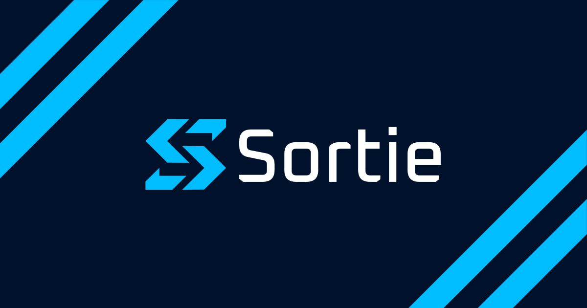

<p align="center">
  
</p>

<div align="center">


**Your next sprint isn't capped by headcount.**

The open-source coding agent orchestrator.<br/>
Turn tracker tickets into autonomous agent sessions. Agent-agnostic, tracker-agnostic. Run in parallel.

[](https://github.com/sortie-ai/sortie/actions/workflows/ci.yml)
[](https://codecov.io/gh/sortie-ai/sortie)

[Documentation](https://docs.sortie-ai.com) · [Contributing](CONTRIBUTING.md)

**English | [简体中文](README.zh-CN.md)**

</div>

Sortie assumes your coding agent already produces useful results when you run it manually. Around that agent it handles parallel scheduling, isolated workspaces, persistent state with retry, CI feedback, review comments, and cost tracking. Sortie does not improve the agent's output.

## Install

```bash
curl -sSL https://get.sortie-ai.com/install.sh | sh
```

Or via Homebrew: `brew install sortie-ai/tap/sortie`

## The Problem

Coding agents can handle routine engineering tasks — bug fixes, dependency updates, test coverage, feature work — when they have good system prompts, appropriate tool permissions, and have been tested on representative issues. But running validated agents at scale requires infrastructure that doesn't exist yet: isolated workspaces, retry logic, state reconciliation, tracker integration, cost tracking. Teams build this ad-hoc, poorly, and differently each time.

Sortie is that infrastructure.

## How It Works

Define your `WORKFLOW.md` in a single file alongside the target repository:

```markdown
---
tracker:
  kind: github
  api_key: $GITHUB_TOKEN
  project: acme/billing-api
  query_filter: "label:agent-ready"
  active_states: [todo, in-progress]
  handoff_state: review
  terminal_states: [done]

agent:
  kind: claude-code
  max_concurrent_agents: 4
---

You are a senior engineer.

## {{ .issue.identifier }}: {{ .issue.title }}

{{ .issue.description }}
```

Sortie watches this file, polls for matching issues, creates an isolated workspace
for each, and launches the agent with the rendered prompt. It handles the rest:
stall detection, timeout enforcement, retries with backoff, state reconciliation
with the tracker, and workspace cleanup when issues reach terminal states. Changes
to the workflow are applied without restart.

The `agent.kind` field selects which coding agent runs each session. Sortie ships
adapters for Claude Code, Copilot, and Codex — switching is a one-line change.
See the [adapter reference](https://docs.sortie-ai.com/reference/) for configuration
details and [`examples/`](examples/) for complete workflow files.

## Architecture

Sortie is a single Go binary. It uses SQLite for persistent state (retry queues, session
metadata, run history) and communicates with coding agents over stdio. The orchestrator
is the single authority for all scheduling decisions; there is no external job queue or
distributed coordination. For full architectural details, see
[`docs/architecture.md`](docs/architecture.md).

Issue trackers and coding agents are integrated through adapter interfaces. Adding support
for a new tracker or agent is an additive change: implement the interface in a new package.

Supported trackers: GitHub Issues and Jira. Supported agents: Claude Code, Copilot,
and Codex. See [`docs/decisions/`](docs/decisions/) for detailed rationale on technology
choices.

## Documentation

Full configuration reference, CLI usage, and getting started guide:
[docs.sortie-ai.com](https://docs.sortie-ai.com)

## Prior Art

Sortie's architecture is informed by [OpenAI Symphony](https://github.com/openai/symphony),
a spec-first orchestration framework with an Elixir reference implementation. Sortie diverges
in language (Go for deployment simplicity), persistence (SQLite instead of in-memory state),
extensibility (pluggable adapters for any tracker or agent, not hardcoded to Linear and Codex),
and completion signaling (orchestrator-managed handoff transitions instead of relying solely on
agent-initiated tracker writes).

## Why "Sortie"

A _sortie_ is a military and aviation term for a single mission executed autonomously. The
metaphor is precise: the orchestrator dispatches agents on missions (issues), each with an
isolated workspace, a defined objective, and an expected return. The name is short, two
syllables, pronounceable across languages, and does not conflict with existing projects in
this domain.

## Roadmap

See our [project board](https://github.com/orgs/sortie-ai/projects/1) for current status and priorities.

## License

[Apache License 2.0](LICENSE)
