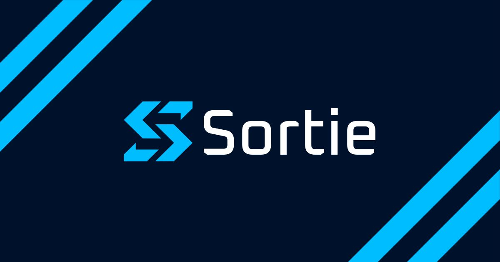

<p align="center">
  
</p>

<div align="center">


**下一个迭代，不再受限于人力。**

开源编程智能体编排器。<br/>
让你常用的编程智能体在自己的电脑或服务器上，并行处理工单系统中的任务。

[](https://github.com/sortie-ai/sortie/actions/workflows/ci.yml)
[](https://codecov.io/gh/sortie-ai/sortie)
[](https://pkg.go.dev/github.com/sortie-ai/sortie)

[官网](https://sortie-ai.com) · [文档](https://docs.sortie-ai.com) · [参与贡献](CONTRIBUTING.md)

**[English](README.md) | 简体中文**

</div>

你的编程智能体能够修复缺陷或实现功能。但要同时推进多项任务，仍需准备工作区、重新启动失败的任务，并跟进 CI 和评审意见。

Sortie 负责这些协调工作，让你专注于成果。前提是你的智能体在手动运行时已经能够产出有价值的成果；代码质量仍取决于智能体和你提供的指令。

## 支持的工具

**工单系统：** GitHub Issues、GitLab Issues、Gitea Issues、Linear 和 Jira。

**编程智能体：** Claude Code、Copilot、OpenCode、Codex、Kiro 和 Gemini CLI。

## 安装

```bash
curl -sSL https://get.sortie-ai.com/install.sh | sh
```

或通过 Homebrew 安装：`brew install --cask sortie-ai/tap/sortie`

先用模拟智能体[在本地体验](https://docs.sortie-ai.com/getting-started/quick-start/)，无需连接外部服务；也可以[连接你的工单系统和编程智能体](https://docs.sortie-ai.com/getting-started/)。

## 运行原理

1. 在一个 `WORKFLOW.md` 文件中指定要处理的工单、要运行的智能体，以及给它的指令。
2. Sortie 获取符合条件的工单，并行运行智能体，每个智能体都在独立的工作区中工作。
3. 运行失败时自动重试。启用 CI 和评审反馈后，检查失败信息和评审意见会传回智能体。

运行历史在重启后仍然保留。你可以追踪进度和成本，修改工作流也无需重启 Sortie。

Sortie 是一个独立的可执行文件，无需另行部署数据库或任务队列。Sortie 本身不发送遥测数据。

## 文档

完整的配置参考、CLI 用法和入门指南：[docs.sortie-ai.com](https://docs.sortie-ai.com)

- [使用指南](https://docs.sortie-ai.com/guides/)
- [架构](https://docs.sortie-ai.com/concepts/architecture/)
- [路线图](https://github.com/orgs/sortie-ai/projects/1)

## 先前工作

Sortie 的架构借鉴了 [OpenAI Symphony](https://github.com/openai/symphony)。

## 为何取名“Sortie”

法语中的 _sortie_ 意为“出口”或“离开”，在航空领域也指单架飞机执行的一次任务。Sortie 将编程智能体派去执行各自的任务：每个工单都有独立的工作区、明确的目标，以及需要带回的成果。

## 许可证

[Apache License 2.0](LICENSE)
